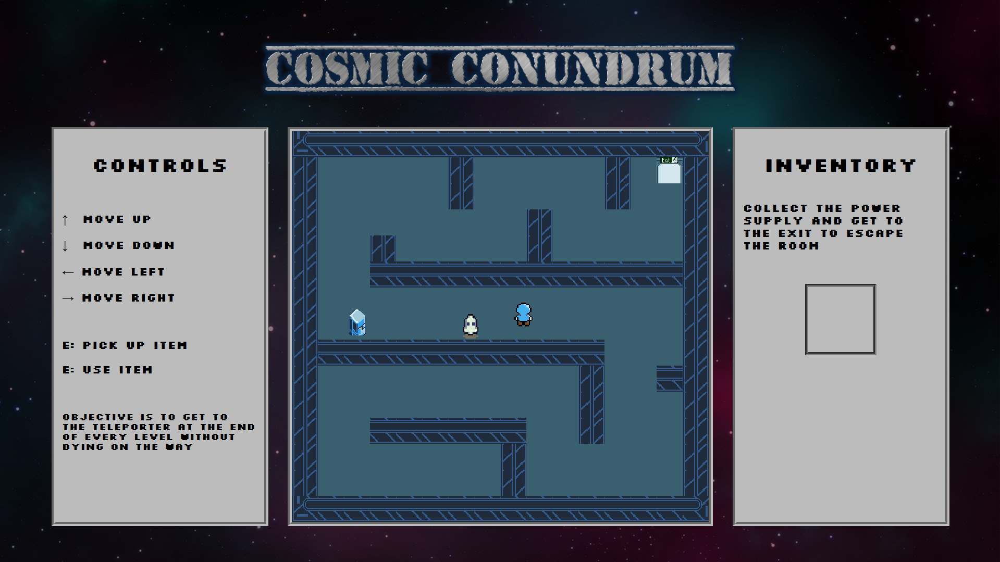

## Cosmic Conondrum
**Datastrukturer og Algoritmer - Eksamensprojekt**
Sommer 2024

**Lavet af:**

Steffen Grøn Andersen

Mathias Kaae

**Deployed:** https://mkaae.github.io/CosmicConumdrum/

Vi har udviklet et 2D-spil, der demonstrerer funktionaliteten af A* algoritmen. Spillet viser en spiller (mand) og en fjende (spøgelse) på en bane med vægge og en "Power Supply", som skal samles op, før man kan gennemføre banen ved at træde ind på slut-feltet. Fjenden vil jagte spilleren, og hvis den rammer spilleren, slutter spillet.

